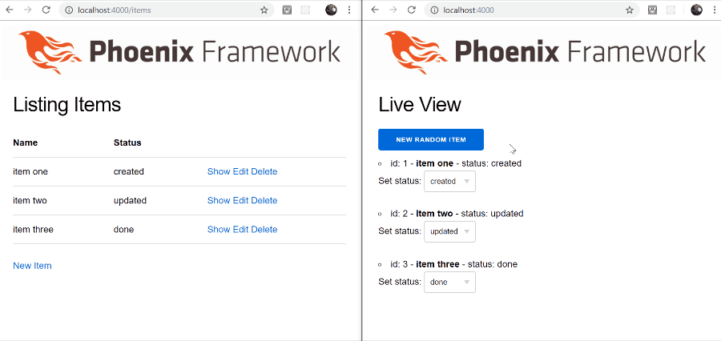

# LiveDemo

## Phoenix LiveView dashboard demo

> **tl;dr** LiveView dashboard that updates from changes in the database, triggered by [PubSub](https://hexdocs.pm/phoenix/1.1.0/Phoenix.PubSub.html#functions)

**What is this?**

A simple demo of [Phoenix LiveView](https://github.com/phoenixframework/phoenix_live_view) functionality for a "live dashboard". 
When "items" in the database are changed, the dashboard updates without reloading the page.

Below we have the standard [phx.gen.html](https://hexdocs.pm/phoenix/Mix.Tasks.Phx.Gen.Html.html) scaffold on the left, and a LiveView on the right.

As we create, modify or delete the items, they are updated automagically in the LiveView.

**How can I try it out?**

- Clone the repo
- Install dependencies with `mix deps.get`
- Create and migrate your database with `mix ecto.setup`
- Install Node.js dependencies with `cd assets && npm install`
- Start Phoenix endpoint with `mix phx.server`

Visit [`localhost:4000`](http://localhost:4000) from your browser for the live view, and [/items](http://localhost:4000/items) for the items crud scaffold.

**How does it work?**

- Once LiveView is setup in your project ([docs](https://github.com/phoenixframework/phoenix_live_view/blob/master/lib/phoenix_live_view.ex), [tutorial](https://elixirschool.com/blog/phoenix-live-view/#getting-started)), you can define a module to `use LiveView`, and then implement `render/1`, `mount/2`, and `handle_event/3` functions to control your live view.

- In this specific example, the [`render`](lib/live_demo_web/live/live_view.ex) function just renders the simple live template. The `mount` function retrieves the items from the database and then subscribes to the PubSub topic. The 2 `handle_event` functions are used from the live view when creating or updating an item. The `handle_info` function re-fetches the database items to supply them to the live view.

- When items are updated in the database using the [`Items`](lib/live_demo/items.ex) context, we call PubSub.broadcast on the same topic which notifies the live view to update.
